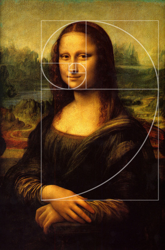
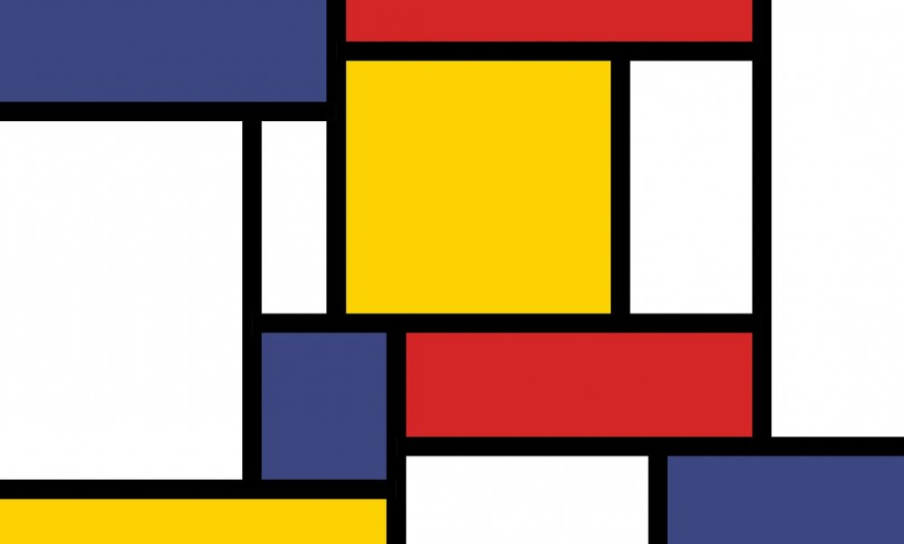
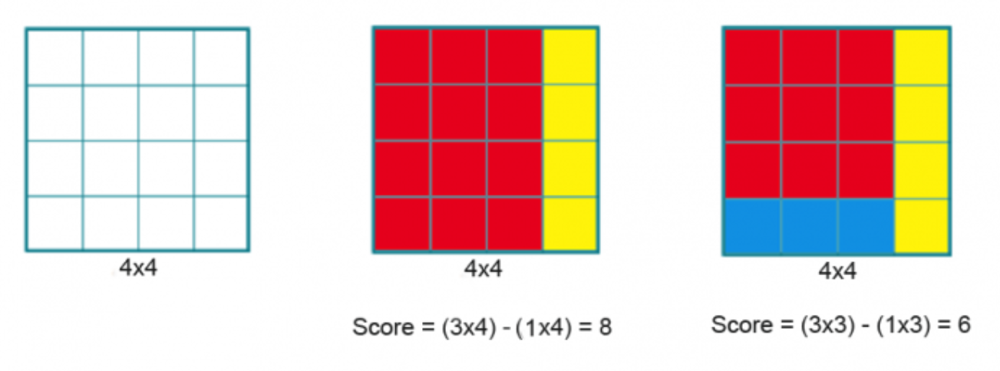

<h1>
To Math or to Art
</h1>

That is the question.

The first thought mathematics brings to most of our minds is may vary. For some it may be complex equations, for others it may be an elegant expression of abstract concepts. But I'm willing to bet that this first thought is not art. The mathematics hiding in famous artworks is often overlooked, by mathematicians and artists alike. 

<h3>The Mona Lisa</h3>

<i>Courtesy : https://thefibonaccisequence.weebly.com/mona-lisa.html</i>

Painted by Leonardo da Vinci, the Mona Lisa currently hangs in the Louvre Museum in Paris. This painting is  quite a famous example of how the golden ratio is the most "natural ratio", arising almost everywhere in nature. Mathematically speaking, two quantities $a$ and $b \space (a>b>0)$ are said to be in the golden ratio if
$$
\frac{a+b}{a} = \frac{a}{b} =\phi \\
\phi = \frac{1+\sqrt{5}}{2} \approx 1.618
$$
This number pops in the most unexpected places, from seeds in a sunflower to nautilus shells. But a most striking feature of this ratio is that we are inherently hardwired to be attracted to places where this ratio is dominant. It's similar to how there are fat rectangles, how there are tall and thin rectangles and how there are rectangles which seem just right. 

The abundance of the golden ratio in the Mona Lisa is quite evident. The ratio of the sizes of the various physical features of her face is precisely the golden ratio. The existence of various symmetries and proportions in the painting is what makes it so aesthetically appealing. Something about it just seems so natural, so real. Why generations of people have studied and been enamoured by the charm of Mona Lisa has everything to do with the golden ratio. 

Sources suggest Da Vinci was aware of such mathematical principles at the time. Da Vinci created the illustrations for the book “De Divina Proportione” (The Divine Proportion) by Luca Pacioli. The book contains dozens of beautiful illustrations of three-dimensional geometric solids and templates for script letters in calligraphy. In the book, Pacioli writes of mathematical and artistic proportion, especially the mathematics of the golden ratio and its application in art and architecture. The original manuscript can be view [here](http://issuu.com/s.c.williams-library/docs/de_divina_proportione).

<h3>Starry Night</h3>

<i>Courtesy : https://www.vangoghgallery.com/painting/starry-night.html</i>

Another instantly recognizable work of art is Starry Night, by Vincent van Gogh. Although there is no historical evidence that van Gogh explicitly dealt with mathematics in his pieces, modern day examination of the painting from a mathematical standpoint has revealed a lot of mathematical concepts lurking within. The painting explores a problem, unsolved to this day i.e, constructing a theoretical model to turbulent fluid flow. Mathematically, turbulence can be described as a chaotic system, meaning that it has unpredictable and random outcomes due to a high potential to change behaviour with small changes to the initial state of the system.

In the 1940s, Soviet scientist Andrei Kolmogorov built the foundations of the modern theory of turbulence. This was expanded upon a team of scientists who even wrote a paper describing how this is depicted in Starry Night. The paper can be viewed [here](https://arxiv.org/abs/physics/0606246). 

Van Gogh seems to be the only painter able to render turbulence with such mathematical precision. As J.L. Aragon puts it, "We have examined other apparently turbulent paintings of several artists and find no evidence of Kolmogorov scaling." Kolmogorov scaling essentially refers to the probability of finding a particular velocity difference between any two parts of the fluid. This is evident by the brushwork, where mixing of paints creates eddies and swirls of different sizes.

<h3>Mondrian Math </h3>

Piet Mondrian, one of the leading proponents of the Dutch abstract art movement is probably most notable for his seemingly simple rectangular-esque paintings.

<i>Courtesy : https://www.iamexpat.nl/lifestyle/lifestyle-news/life-dutch-artist-piet-mondrian </i>

This painting has been not only an inspiration to artists, but is also the reason behind math problems. Dubbed as Mondrian's Math Problem, the problem goes as follows. Divide a grid of dimensions $n \times n$ into rectangles and squares of whole and incongruent sides (i.e. no two are equal), so that the difference between the surface of the largest and smallest rectangle is as small as possible. That subtraction will give the score.

For example, take the $4 \times 4$ grid. One possible solution is to divide the grid into two rectangles of $3 \times 4$ and $1 \times 4$, which gives a score of $8$. One way to improve the result is to divide the grid into $3$ rectangles, which lowers the score to $6$. Finding out the optimal solution is left as an exercise to the reader (CBSE ;))

These seemingly simple problems have been the subject of various paper to optimize algorithms to find solutions such as [these](https://arxiv.org/abs/2007.09639).

As described, the intertwining between math and art cannot be understated. Clearly, both have influenced developments in each other, and although seemingly unrelated, the correlation between them is evident. 

Perhaps next time, when you lift your pencil to doodle idly in math class, you may be creating the art to shape a new branch of math.

<u>References</u>

https://www.goldennumber.net/leonardo-da-vinci-golden-ratio-art/

https://www.nature.com/news/2006/060703/full/news060703-17.html

https://mathpickle.com/project/mondrian-art-puzzles/

$ \4 $

